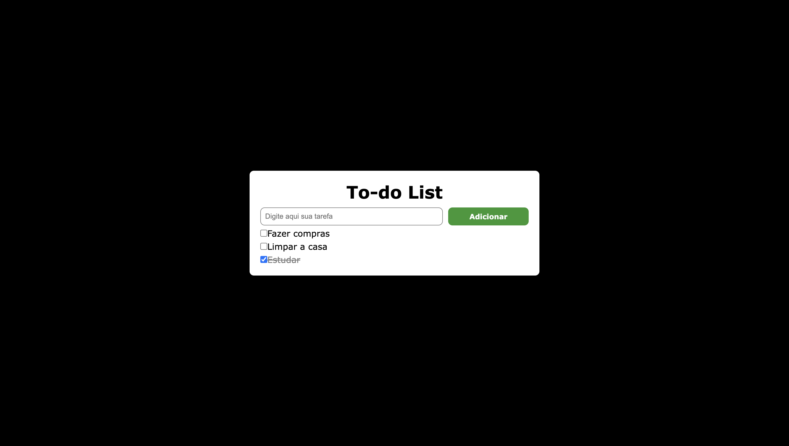

# Projeto de To-do List em JavaScript

Mais um projeto referente ao bootcamp de JavaScript da DIO.

## Objetivo 

Criar uma página com uma To-do List dinâmica onde podem ser inseridas tarefas a fazer e marcá-las quando completas.

## Processo

Esse foi um desafio mais complicado pois muitos dos termos utilizados ainda não cheguei a estudar no curso. Por isso, busquei ao site [W3 Schools](https://www.w3schools.com/) formas de fazer o programa e também utilizei como referência o [projeto](https://github.com/stebsnusch/basecamp-javascript/tree/main/introducao-ao-javascript/to-do%20list) da professora @stebsnusch.

Também contei com a ajuda do ChatGPT para me dar insights sobre o código. Note que não pedi ao chatGPT que criasse o programa pra mim, mas que me explicasse ferramentas que poderiam ser utilizadas me mostrando o como e por que de utilizá-las.

Feito isso, criei a minha própria versão do programa, que por mais que seja simples, foi um grande desafio. Fico feliz que deu certo no final, que continuem os estudos e eu evolua a cada dia! 

## Resultado

